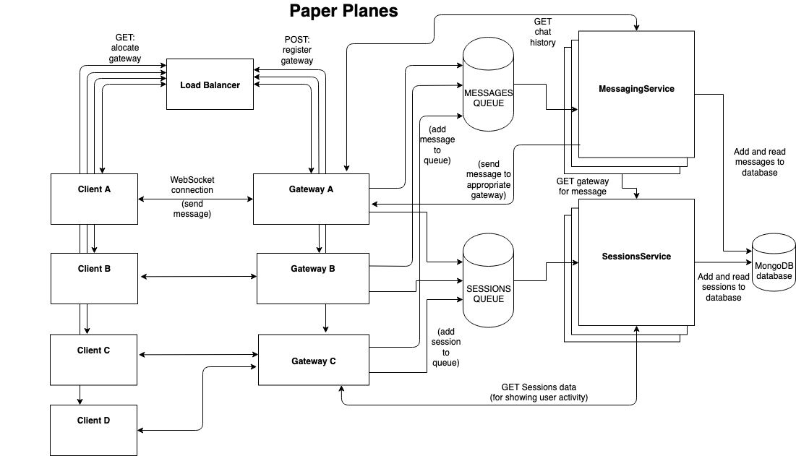

# Paper Planes

Paper Planes is a scalable distributed messaging app that can be accessible across multiple platforms.

It comprises of multiple gateway servers where clients can directly connect to, and forward all messages and requests to the appropriate service. A load balancer is used in order to direct each client to a gateway. The session service keeps track of the gateway each client is connected to. The messaging service deals with the logic of storing and sending messages to other clients, using the session service to locate the gateway the client is connected to.

## Installation

To run this program, you'll need Java 8, Maven and Docker (you'll be using docker-compose). 

To run the program locally, in the command line navigate to the root folder and type:

``` bash
mvn clean package
```

After this has been completed successfully, run:

``` bash
docker-compose build && docker-compose up
```

This runs the gateway on localhost:8080 and the load-balancer on localhost:8081. Currently the load-balancer is not used by the client due to Docker woes.

To run the client, run:

```bash
mvn compile exec:java
```

### Note

There are some race conditions associated with the start-up of each component in Docker. It may be necessary to increase the Thread.sleep() for when some modules are starting up, depending on your processor speed. This is especially noticeable with gateway.
The system should be ready to go when it displays the message:

```
 gateway_1          | Server started successfully – clients can now connect
```


## Technology Stack

**WebSockets** are used to provide a real-time connection between the client and gateway, letting the client send and receive messages in real time as well transferring accurate information about the online status of other users. WebSockets are also used to transfer messages from the messaging service to gateways during message processing.
  
**Spring Boot** is used for creating REST endpoints that the services use to interact in situations where a response is expected. For example, REST is used when retrieving the correct gateway from the load balancer, or when requesting chat log history from the messaging service.

**ActiveMQ** and **JMS** are used to create queues that allow us to share the workload among multiple instances of a service, adding to the scalability of the system. These are used where responses are not necessarily expected to go to the instance that created a message e.g. when a message is placed in the MESSAGES queue by a gateway, it might not necessarily be forwarded to that gateway after processing.
  
**MongoDB** database used to store information about the status of individual users in the system as well as storing information about the messages.



# Authors

* Oisín Quinn - @oisinq
* Darragh Clarke – @DarraghClarke
* Sinéad Farrell - @sineadfarrell

Created as a standalone group project for [COMP30220](http://www.ucd.ie/modules/comp30220).
